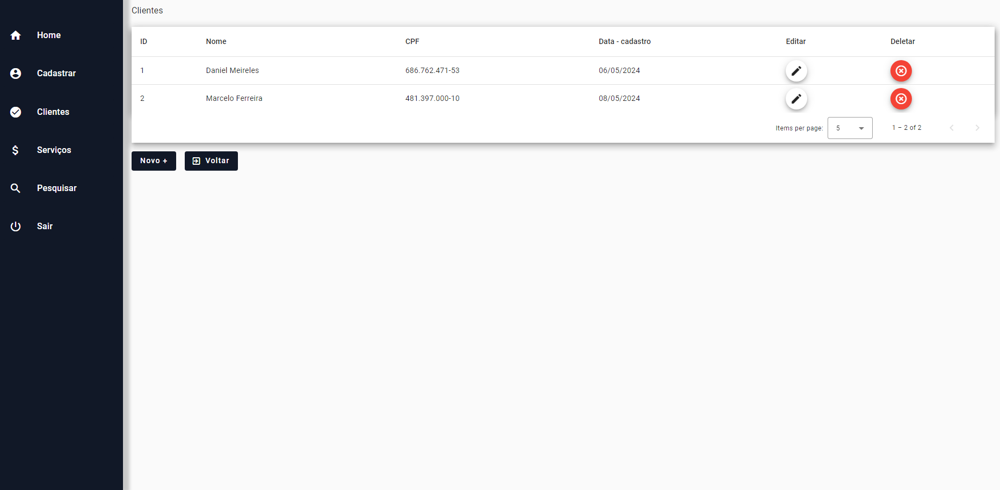

# Gerenciador de serviços e clientes

Este é um projeto de um gerenciador de serviços e clientes. Ele contém autenticação com JWT e Spring Security, com uma SPA intuitiva com Angular e Angular material para geração de componentes.

Esse projeto é acadêmico para fins de estudos, portanto todo o código pode ser copiado e implementado em outros projetos/aplicações.

Esse projeto conta com as boas práticas do desenvolvimento web com uma arquitetura ***REST***. Abaixo você podera ver toda es estrutura de pastas do back-end e do front-end seguindo as boas práticas. Esse projeto conta com validações de formulários, validações no back-end utilizando o ***Validation*** do Spring entre outras boas práticas.

## Backend

- **src/**
  - **main/**
    - **java/com/full/servicos/**
        - `📂 config`
        - `📂 controller`
        - `📂 domain`
        - `📂 dto`
        - `📂 exception`
        - `📂 repository`
        - `📂 service`
        - `📂 util`
        - `ServicosApplication.java`
    - **resources**
        - `application.yml`
        - `application-dev.yml`
        - `application-prod.yml`
        - `application-test.yml`
  - **test/**
    - **java/com/full/servicos/**
        - `📂 services`
        - `ServicosApplicationTests.java`

## Frontend

- **src/**
  - **app/**
    - **core/**
        - `📂 components`
        - `📂 config`
        - `📂 guards`
        - `📂 interceptors`
        - `📂 pipes`
        - `📂 services`
    - **features/**
        - `📂 clientes`
        - `📂 servicos-prestados`
    - **shared/**
        - `📂 enums`
        - `📂 home`
        - `📂 layout`
        - `📂 login`
        - `📂 models`
  - **assets/**
    - **images/**
      - (imagens do projeto)

### Imagens e descrição do projeto

- Aqui temos a parte de cadastro do usuário que vai acessar o sistema, ele pode escolher entre ser um ***ADMIN/USER*** ele pode terá que passar um usuário e senha e com isso ele vai se cadastrar no sistema e ter o acesso.

- Logo após ele precisa se autenticar para poder ter acesso a todas funcionalidades do sistema, como cadastrar clientes, listar e etc. O token ***JWT*** vai estar guardado na local storage do seu navegador.

- Agora é possível enxergar a ***Home*** do sistema no qual podemos ver o total de clientes cadastrados no primeiro card, no segundo temos a média de clientes mensais e no terceiro o valor do último serviço ou venda prestado com a imagem dele.

- Essa é a parte do cadastro de clientes, onde é possível cadastrar o ***Nome*** e o ***CPF*** do cliente. Os demais inputs como podemos ver estão desabilitados pois são gerados assim que é mandado a requisiçãom para o back-end.

- Aqui temos a lista de clientes do nosso sistema, é possível ver uma tabela com paginação. A consulta está sendo feita no back-end e sendo paginada dos dois lados, tanto do servidor quanto do cliente, com isso seguimos a boa prática do desenvolvimento web.

- Agora vamos para parte de registro de seviços/vendas prestados. Como podemos ver temos uma ***Descrição, Valor e Data*** para ser preenchidos, além de anexar a imagem do produto logo abaixo.

- A última parte do sistema e não menos importante, é a parte da pesquisa de serviços onde podemos simplesmente pesquisar pela ***Nome*** do cliente e ***Mês*** no qual foi cadastrado juntamente ao serviço.

### Stack utilizada:

